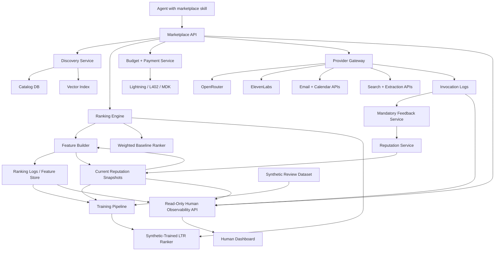
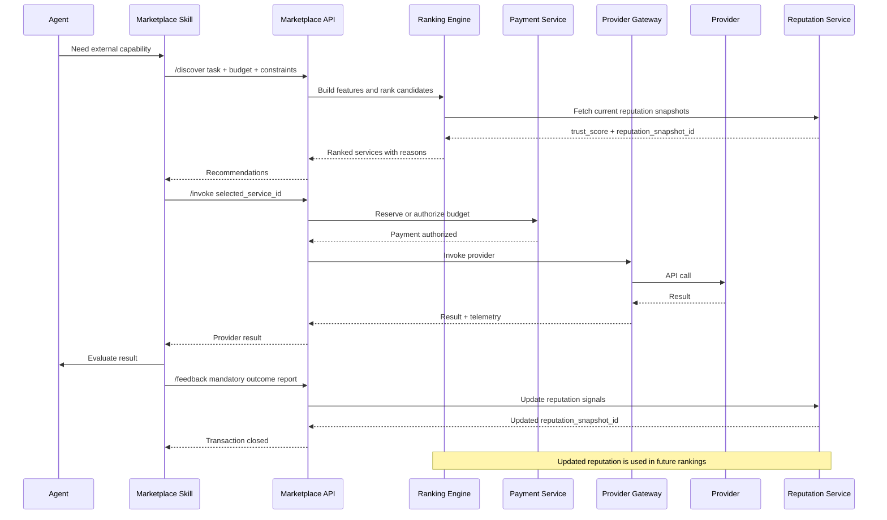
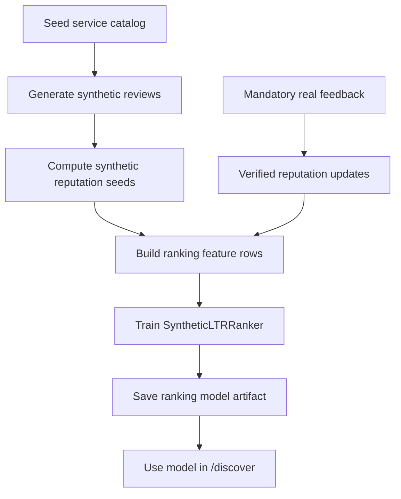

# Agent-to-Service Marketplace Architecture

## Executive Summary

We are building an agent-facing marketplace where AI agents can discover, rank, pay for, invoke, and review external services. The MVP should be understood as **OpenRouter for agent services**, extended with search, reputation, budget controls, mandatory outcome feedback, Lightning-based payments, and a ranking model trained from seeded review data.

The hackathon version should stay API-first. We are not building the full agent-to-agent economy in the MVP. Instead, we will start with a curated catalog of existing APIs and OpenRouter-hosted models, such as agentic email, calendar/scheduling, web research, web extraction, voice/audio, and model services. The agent interacts with the marketplace through a skill/tool interface, not primarily through a human-facing storefront.

Key decisions:

- **Scope:** Start with existing fixed-price APIs and models. Defer bespoke bidding, escrow, and dispute resolution.
- **User:** The direct customer is an AI agent acting on behalf of a human or organization.
- **Agent interface:** The operational "front end" is an agent skill that teaches the agent when and how to use the marketplace.
- **Human UI:** Humans get a read-only observability UI. They can inspect activity, rankings, payments, invocations, reputation, and reviews, but they cannot interact with the marketplace or change state.
- **Discovery:** Use a catalog database plus semantic search over service descriptions, model cards, examples, and capability metadata.
- **Capability match:** Treat capability matching as an eligibility filter, not a ranking score.
- **Model provider policy:** Do not integrate Gemini directly. Use OpenRouter for LLM/model access.
- **OpenRouter model granularity:** Treat each OpenRouter model as its own marketplace service object, even though all are invoked through the same OpenRouter API key.
- **Ranking baseline:** Keep a simple predefined weighted ranker as a fallback:
  - `50% task_relevance`
  - `30% trust_score`
  - `20% cost_value`
- **Learning-to-rank MVP:** Create synthetic customer reviews/outcomes for every seeded solution and train the first LTR model on that synthetic dataset.
- **Feedback:** Mandatory agent feedback is part of the transaction lifecycle. A marketplace call is not closed until the agent submits outcome feedback.
- **Reputation:** Reputation must be transaction-backed. Reviews only count when tied to verified marketplace usage.
- **Reputation-to-ranking loop:** The ranking engine must read current reputation snapshots before every ranking decision. Feedback updates reputation, and updated reputation changes future rankings.
- **Payments:** Use Lightning as the payment rail. The marketplace should enforce per-task budgets and prevent services from exceeding approved spend.
- **Demo strategy:** Show an agent discovering a needed capability, selecting the best service, paying through the marketplace, receiving a result, and submitting mandatory feedback that updates reputation.

The central product claim is:

> Agents should not call random APIs blindly. They need a trust-aware purchasing layer that can discover, rank, pay for, invoke, and learn from paid services automatically.

## MVP Goal

The MVP should demonstrate one complete loop:

1. Before the demo, the marketplace generates synthetic reviews and trains `SyntheticLTRRanker`.
2. An agent receives a task it cannot complete with its built-in capabilities.
3. The agent uses the marketplace skill to search for an external service.
4. The marketplace filters and ranks candidate services using the synthetic-trained ranker.
5. The agent selects a recommended service within a budget.
6. The marketplace authorizes payment through Lightning.
7. The provider gateway invokes the selected API.
8. The agent receives the result.
9. The agent submits mandatory outcome feedback.
10. The marketplace updates transaction logs and reputation signals.
11. Future ranking calls use the updated reputation snapshots.
12. A human observer can inspect the full trace and reviews in a read-only dashboard.

This is enough to satisfy the challenge requirement that value moves between agents/services and to show why open, low-friction micropayments matter.

## Non-Goals For Hackathon MVP

These are important for the broader vision but should not block the demo:

- Full open provider registration.
- Agent-to-agent bespoke work marketplace.
- Provider bidding and negotiation.
- Escrow, arbitration, and dispute resolution.
- Complex identity or staking system.
- Fully trained production learning-to-rank model.
- Real customer review corpus.
- Completely decentralized marketplace state.
- Large-scale fraud detection.
- Human-initiated marketplace actions, including human search, provider selection, invocation, payment, or review submission.

The architecture should leave room for these later, but the MVP should not depend on them.

## System Overview



The important loop is:

```text
mandatory feedback -> reputation snapshot -> ranking features -> ranked recommendation -> invocation -> mandatory feedback
```

Every ranking event should record which reputation snapshot was used, so the system can explain why a provider was ranked highly at that point in time.

## Core Workflow



## Pre-Demo Training Workflow

Before the live demo, the marketplace should bootstrap its ranking behavior with synthetic reviews:



During the demo, the model can honestly be described as trained on synthetic seed data, with verified marketplace feedback beginning to replace synthetic assumptions as soon as real invocations happen.

## Feature-By-Feature MVP Plan

### 1. Agent Marketplace Skill

The skill is the agent-facing front end. It tells the agent when to use the marketplace, how to search, how to respect budgets, how to invoke paid services, and how to submit feedback. This is the only interface that should perform marketplace actions in the MVP.

MVP behavior:

- Trigger when the agent lacks a capability or needs a better specialized provider.
- Ask for or infer a task budget before paid invocation.
- Call `/discover` with the task, budget, and constraints.
- Present the top recommendation and reasons, including trust/reputation signals.
- Invoke the selected service through `/invoke`.
- Evaluate whether the result solved the task.
- Submit mandatory feedback through `/feedback`.
- Refuse to consider the paid task complete until feedback is submitted.

Implementation deliverables:

- `SKILL.md` or equivalent agent instructions.
- Small client script or tool wrapper for calling the marketplace API.
- Clear mandatory feedback instruction:

```text
After every paid marketplace invocation, you must submit outcome feedback before considering the marketplace task complete.
```

### 2. Read-Only Human Observability UI

Humans should be able to see what is happening, but they should not be able to operate the marketplace directly.

Allowed human UI behavior:

- View current service catalog and OpenRouter model service rows.
- View synthetic reviews and verified feedback, clearly labeled by source.
- View ranking events, candidate scores, reasons, and reputation snapshots used.
- View transaction state transitions.
- View budget authorization and payment traces.
- View provider invocation telemetry.
- View reputation changes before and after feedback.
- View the synthetic LTR training artifact and feature importance/summary if available.

Forbidden human UI behavior:

- No `/discover` calls initiated by humans.
- No provider selection.
- No `/invoke` calls.
- No payment authorization.
- No feedback or review submission.
- No manual reputation edits.
- No manual ranking overrides.

Implementation rule:

> The human UI is a read-only observability surface. The agent skill is the marketplace client.

The human UI should call read-only endpoints only and must not expose controls that mutate marketplace state.

### 3. Service Catalog

The catalog is the source of truth for available services.

MVP catalog should be curated manually. We need enough services to cover the tasks hackathon users are likely to ask for: email, scheduling, research, scraping/extraction, model selection, and voice/audio.

Recommended initial categories:

- Agentic email and inbox workflows.
- Calendar and scheduling.
- Web research.
- Web extraction.
- LLM/model access through OpenRouter.
- Text-to-speech or voice generation.

Do not integrate Gemini directly. If we want Gemini-like model selection, the marketplace should route through OpenRouter and represent each OpenRouter model as a separate service row.

Seed API keys/accounts to create:

| Category | Provider / key | MVP capability | Free-tier basis |
|---|---|---|---|
| Agentic email | [Google Gmail API](https://developers.google.com/workspace/gmail/api/reference/quota) OAuth client | Read, label, draft, and send Gmail messages for demo accounts | Quota-limited API access |
| Agentic email | [Resend](https://resend.com/pricing/) API key | Transactional and follow-up emails | Free plan: 3,000 emails/month, 100/day |
| Agentic email | [Mailjet](https://www.mailjet.com/pricing/) API key | Email API and SMTP relay | Free plan: 6,000 emails/month, 200/day |
| Agentic email | [SMTP2GO](https://www.smtp2go.com/pricing) API key | Simple outbound SMTP/API fallback | Free plan: 1,000 emails/month |
| Calendar/scheduling | [Google Calendar API](https://developers.google.com/calendar/api/guides/quota) OAuth client | Create events, check availability, schedule meetings | Available at no additional cost, quota-limited |
| Calendar/scheduling | [Cal.com Platform API](https://cal.com/platform/pricing) key | Booking links and scheduling workflows | Free developer starter: up to 25 bookings/month |
| Calendar/scheduling | [Nylas](https://www.nylas.com/pricing/) API key | Unified email/calendar/contacts sandbox | Free sandbox: up to 5 connected accounts |
| Web research | [Tavily](https://www.tavily.com/pricing) API key | Agent-native web search | Free plan: 1,000 API credits/month |
| Web research | [Exa](https://exa.ai/pricing) API key | Web search plus page contents for agents | Free: up to 1,000 requests/month |
| Web research | [SerpApi](https://serpapi.com/pricing) API key | SERP fallback for Google-like searches | Free plan: 250 searches/month |
| Web extraction | [Firecrawl](https://docs.firecrawl.dev/billing) API key | Scrape/crawl pages into clean markdown | Free plan: 500 credits |
| Web extraction | [Apify](https://apify.com/pricing) API token | Prebuilt actors for scraping/automation | Free plan: $5 monthly platform usage |
| Model services | [OpenRouter](https://openrouter.ai/collections/free-models) API key | Multiple LLM/model services, each listed separately | Free models available; subject to provider limits |
| Voice/audio | [ElevenLabs](https://help.elevenlabs.io/hc/en-us/articles/28184926326033-How-much-does-it-cost-to-use-the-API) API key | Text-to-speech and voiceover | API included on free plan, uses included credits |
| Voice/audio | [Deepgram](https://deepgram.com/pricing) API key | Speech-to-text, TTS, and voice-agent audio | Free $200 credit, no card |

OpenRouter model service examples:

| Marketplace service ID | OpenRouter model ID | Intended demo use |
|---|---|---|
| `openrouter_qwen3_coder_free` | `qwen/qwen3-coder:free` | Code, tool-use, and agentic development tasks |
| `openrouter_qwen3_next_free` | `qwen/qwen3-next-80b-a3b-instruct:free` | General instruction following, RAG, and long-context tasks |
| `openrouter_qwen3_4b_free` | `qwen/qwen3-4b:free` | Lightweight general reasoning and fast fallback |

The exact OpenRouter model list should be checked during setup because free model availability changes. The important architectural rule is stable: **the catalog ranks model objects, not the OpenRouter provider as one object**.

Core fields:

```json
{
  "service_id": "openrouter_qwen3_coder_free",
  "name": "Qwen3 Coder Free",
  "provider": "OpenRouter",
  "provider_service_id": "qwen/qwen3-coder:free",
  "capabilities": ["code_generation", "tool_use", "agentic_coding"],
  "input_types": ["text"],
  "output_types": ["text", "code"],
  "description": "Free OpenRouter-hosted coding model optimized for agentic coding tasks.",
  "model_card": "Strong for code generation, repository reasoning, and tool-use-heavy tasks.",
  "pricing_model": "free_tier_limited",
  "estimated_base_cost_usd": 0.0,
  "vetted": true,
  "active": true,
  "adapter_type": "openrouter"
}
```

MVP acceptance criteria:

- Seed the catalog from the 15 provider/API entries above, then add selected OpenRouter models as separate service objects.
- Keep the active demo shortlist to roughly 10 to 15 visible services so the ranking output remains readable.
- OpenRouter models are represented as separate service objects, even when they share one OpenRouter adapter and API key.
- Each service has structured capabilities and a human-readable model/service card.
- Each service can be filtered by capability and budget.
- Each service has synthetic customer reviews before the demo so the LTR model and reputation system have initial data.

### 4. Discovery Service

Discovery retrieves candidate services before ranking.

MVP approach:

- First apply structured filters.
- Then use semantic search over descriptions, model cards, examples, and tags.
- Return a candidate set to the ranking engine.
- The ranking engine enriches candidates with current reputation snapshots before scoring.

Hard filters:

- Service is active.
- Service is vetted.
- Service supports the required capability.
- Service supports the required input/output type.
- Estimated cost is within the user-approved budget.
- Payment route is available.

Important distinction:

- **Capability match** means "can this service technically do the requested job?"
- **Semantic fit** means "among eligible services, how relevant is this service to this specific task?"

In the MVP, capability match should be a boolean eligibility filter. It should not be a weighted score.

### 5. Ranking Engine

The ranking engine orders eligible services by combining task relevance, current reputation, and cost value. Reputation is not just a post-transaction metric; it is an input to every ranking decision.

MVP principle:

> Build the ranking engine as a learning-to-rank system from day one. The simple weighted model remains a transparent fallback, but the hackathon MVP should also train a lightweight LTR model on synthetic customer review data.

Ranker interface:

```ts
rank({
  task,
  agentContext,
  budget,
  candidates,
  constraints,
  reputationContext
}) -> rankedCandidates[]
```

`reputationContext` should contain the latest reputation snapshot for each candidate service and capability. The ranker should persist the snapshot IDs it used so ranking decisions are explainable and reusable as LTR training rows.

Ranked candidate output:

```json
{
  "service_id": "elevenlabs_tts",
  "rank": 1,
  "score": 0.84,
  "estimated_cost": 0.42,
  "confidence": 0.77,
  "reputation_snapshot_id": "rep_snap_456",
  "trust_score": 0.72,
  "reasons": [
    "high task relevance",
    "strong verified trust score",
    "within budget"
  ],
  "feature_snapshot_id": "fs_123"
}
```

#### Weighted Baseline Model

Keep a simple three-factor ranker as a fallback, debugging tool, and explainable baseline:

```text
score =
  0.50 * task_relevance
+ 0.30 * trust_score
+ 0.20 * cost_value
```

Definitions:

- `task_relevance`: Semantic fit between the user's task and the service description/model card.
- `trust_score`: Current reputation score read from the Reputation Service for the candidate service and requested capability.
- `cost_value`: How attractive the price is relative to the task budget and peer services.

Example:

```json
{
  "task_relevance": 0.86,
  "trust_score": 0.72,
  "reputation_snapshot_id": "rep_snap_456",
  "cost_value": 0.91,
  "final_score": 0.82
}
```

The weights should live in configuration:

```json
{
  "task_relevance": 0.50,
  "trust_score": 0.30,
  "cost_value": 0.20
}
```

#### Synthetic-Trained LTR Model

The MVP should create synthetic customer reviews for every seeded service and train the first learning-to-rank model on that synthetic corpus.

Why synthetic data is acceptable for the hackathon:

- We will not have real marketplace transaction history on day one.
- The demo needs visible ranking behavior beyond hand-picked rules.
- Synthetic reviews let us show the full lifecycle: reviews -> reputation -> ranking model -> recommendations -> mandatory feedback -> updated reputation.
- Synthetic records must be marked as synthetic and separated from verified transaction-backed reviews.

MVP model options:

- Preferred: a lightweight gradient-boosted regressor or classifier trained on candidate features and synthetic utility labels.
- Acceptable fallback: logistic regression or linear regression over the same feature table.
- Debug fallback: the weighted baseline model.

Initial ranker modes:

```text
ranker.mode = "weighted" | "synthetic_ltr"
```

For the hackathon demo:

```text
ranker.mode = "synthetic_ltr"
```

The weighted model should still be available because it makes the scoring logic easy to explain if the synthetic model behaves unexpectedly.

Synthetic review training label:

```text
synthetic_utility =
  0.45 * task_success
+ 0.25 * quality_score
+ 0.15 * would_use_again
+ 0.10 * price_fair
+ 0.05 * latency_ok
```

Pairwise ranking rows can be derived by comparing services within the same task scenario. For example, if three services are reviewed for "send a concise follow-up email after a meeting," the model learns which service should rank above the others for that scenario.

The architecture should include:

- A `Ranker` interface.
- A `WeightedRanker` implementation.
- A `SyntheticLTRRanker` implementation.
- A synthetic review generator or seed file.
- A training script that converts synthetic reviews into feature rows and labels.
- Feature snapshots for every ranked candidate.
- Reputation snapshot references for every ranked candidate.
- Ranking event logs.
- Selection logs.
- Mandatory feedback labels.
- A config switch between weighted and synthetic LTR ranking.

Training data example:

```json
{
  "training_row_id": "train_123",
  "source": "synthetic_review",
  "task": "Send a concise follow-up email after a hackathon meeting",
  "budget_usd": 3.0,
  "candidate_service_ids": ["gmail_api", "resend_email", "mailjet_email"],
  "features_by_service": {
    "resend_email": {
      "task_relevance": 0.93,
      "trust_score": 0.86,
      "reputation_snapshot_id": "rep_snap_seed_101",
      "reputation_features": {
        "synthetic_success_rate": 0.95,
        "synthetic_average_quality": 0.88,
        "synthetic_would_use_again_rate": 0.91
      },
      "cost_value": 0.97,
      "capability_match": true,
      "estimated_cost_usd": 0.0
    }
  },
  "synthetic_review": {
    "task_success": true,
    "quality_score": 0.88,
    "price_fair": true,
    "latency_ok": true,
    "would_use_again": true,
    "review_text": "Delivered a clean follow-up email quickly and was easy to integrate."
  },
  "synthetic_utility": 0.92
}
```

The production learning-to-rank model will eventually replace synthetic labels with verified marketplace outcomes. Until then, synthetic labels are seed data, not proof of real-world quality.

### 6. Mandatory Feedback Service

Mandatory feedback is a core architectural feature, not an optional review system.

A transaction should not be considered complete until feedback is submitted by the agent.

Transaction lifecycle:

```text
created -> authorized -> invoked -> result_delivered -> feedback_required -> closed
```

Minimum feedback payload:

```json
{
  "transaction_id": "txn_123",
  "task_success": true,
  "quality_score": 0.87,
  "result_useful": true,
  "price_fair": true,
  "latency_ok": true,
  "would_use_again": true,
  "failure_reason": null,
  "freeform_note": "Good result, needed minor cleanup."
}
```

Enforcement:

- `/invoke` creates a transaction.
- Provider result moves transaction to `feedback_required`.
- `/feedback` is required to move transaction to `closed`.
- Future marketplace calls by the same agent can be blocked or deprioritized if feedback is missing.

This creates the feedback loop needed for reputation and ongoing ranking-model improvement:

```text
feedback -> reputation update -> next ranking event uses updated trust_score
```

### 7. Reputation Service

Reputation should be based on verified marketplace activity.

The Reputation Service has two jobs:

- **Write path:** consume telemetry and mandatory feedback after each transaction, then update reputation snapshots.
- **Read path:** serve the latest reputation snapshots to the Ranking Engine before every ranking decision.

The MVP should combine:

- Objective telemetry.
- Mandatory agent feedback.
- Synthetic customer reviews and outcomes for every seeded service.
- Manual model/service card metadata.

Objective telemetry:

- API success or failure.
- Latency.
- Final cost vs estimated cost.
- Retry count.
- Error rate.
- Budget overrun attempts.

Agent feedback:

- Task success.
- Quality score.
- Result usefulness.
- Price fairness.
- Whether the agent would use the service again.

MVP trust score:

```text
verified_trust_score =
  0.50 * verified_success_rate
+ 0.30 * verified_average_quality_feedback
+ 0.20 * verified_would_use_again_rate

synthetic_seed_score =
  0.45 * synthetic_task_success_rate
+ 0.25 * synthetic_average_quality
+ 0.15 * synthetic_would_use_again_rate
+ 0.10 * synthetic_price_fair_rate
+ 0.05 * synthetic_latency_ok_rate

trust_score =
  confidence_weight * verified_trust_score
+ (1 - confidence_weight) * synthetic_seed_score
```

`confidence_weight` starts near `0` when a service has no verified marketplace calls and approaches `1` as verified usage accumulates. This lets synthetic reviews bootstrap ranking while ensuring real outcomes eventually dominate.

Ranking integration:

- Reputation is computed per service and, where possible, per capability.
- The Ranking Engine requests the latest `trust_score` for each eligible candidate.
- The Ranking Engine records `reputation_snapshot_id` on each ranked candidate.
- A feedback update should create a new reputation snapshot or update the current snapshot version.
- Future ranking calls should use the new snapshot, not stale reputation embedded in the service catalog.

Later signals:

- Refund rate.
- Dispute rate.
- Human override.
- Provider stake.
- Repeat usage by trusted agents.
- Domain-specific scores by capability.

Important design rule:

> Do not treat agent feedback as pure truth. Combine it with objective telemetry.

### 8. Synthetic Review Dataset And Training

Because the MVP will not have real customer history on day one, we will seed the system with synthetic customer reviews for every service object. This applies to API providers and to every individual OpenRouter model row.

Synthetic reviews should be diverse enough to teach the ranker meaningful tradeoffs:

- Different task scenarios, such as "send follow-up email," "summarize inbox," "schedule meeting," "research a topic," "scrape a page," "choose a coding model," and "generate voiceover."
- Different reviewer profiles, such as hackathon builder, solo founder, developer agent, research agent, and operations agent.
- Positive, mixed, and negative outcomes.
- Provider-specific strengths and weaknesses.
- Cost, latency, quality, reliability, and integration friction.

Minimum synthetic coverage:

- At least 8 to 12 synthetic reviews per service object.
- At least 3 task scenarios per main category.
- At least 2 competing services per task scenario so the model can learn relative preferences.
- Explicit source marker: `source = "synthetic"`.

Synthetic review schema:

```json
{
  "synthetic_review_id": "synrev_001",
  "service_id": "resend_email",
  "capability": "send_email",
  "task_scenario": "send concise post-meeting follow-up",
  "reviewer_profile": "hackathon_builder",
  "review_text": "Easy to integrate and reliable for transactional follow-up emails.",
  "task_success": true,
  "quality_score": 0.88,
  "price_fair": true,
  "latency_ok": true,
  "would_use_again": true,
  "integration_friction": 0.18,
  "synthetic_utility": 0.92,
  "generation_prompt_version": "synthetic_reviews_v1",
  "created_at": "2026-04-25T00:00:00Z"
}
```

Training pipeline:

1. Generate synthetic reviews for all seeded service objects.
2. Convert reviews into per-service reputation seed features.
3. Build task/service feature rows using task relevance, synthetic trust score, cost value, capability match, and service metadata.
4. Create pointwise labels from `synthetic_utility`.
5. Create optional pairwise labels by comparing services within the same task scenario.
6. Train `SyntheticLTRRanker`.
7. Save model artifact and feature schema version.
8. Use mandatory real feedback after demo invocations to start replacing synthetic labels with verified labels.

Training artifact example:

```json
{
  "model_id": "synthetic_ltr_v1",
  "ranker_mode": "synthetic_ltr",
  "trained_on": "synthetic_reviews_v1",
  "feature_schema_version": "ranking_features_v1",
  "provider_key_count": 15,
  "service_object_count": 17,
  "synthetic_review_count": 150,
  "created_at": "2026-04-25T00:00:00Z"
}
```

Important demo disclosure:

> Synthetic reviews bootstrap the model for the hackathon. Verified marketplace feedback is the long-term source of truth.

### 9. Budget And Payment Service

The payment service handles budget authorization, Lightning payment, and spend tracking.

MVP behavior:

- Require a per-task budget before paid invocation.
- Estimate cost before invoking a provider.
- Reject services whose estimated cost exceeds budget.
- Reserve or authorize spend before calling the provider.
- Pay through Lightning, preferably using L402 or MDK if practical.
- Record final spend.
- Optionally charge a marketplace fee.

Budget fields:

```json
{
  "task_budget_usd": 3.0,
  "estimated_cost_usd": 0.42,
  "max_authorized_cost_usd": 0.50,
  "marketplace_fee_rate": 0.05
}
```

MVP payment acceptance criteria:

- Money or simulated money visibly moves through the flow.
- The agent cannot accidentally spend above the approved budget.
- The transaction log records authorization, provider cost, marketplace fee, and final status.

### 10. Provider Gateway

The gateway normalizes calls to different provider APIs.

MVP responsibilities:

- Keep provider credentials server-side.
- Expose one marketplace invocation API to the agent.
- Translate marketplace requests into provider-specific API calls.
- Normalize results.
- Capture telemetry.
- Return provider output to the agent.

Adapter interface:

```ts
invoke({
  serviceId,
  task,
  input,
  budget,
  transactionId
}) -> {
  output,
  rawProviderResponse,
  cost,
  latencyMs,
  success
}
```

Recommended adapters for MVP:

- `openrouter_adapter`
- `tts_adapter`
- `email_adapter`
- `calendar_adapter`
- `search_adapter`
- `extraction_adapter`
- `mock_specialist_adapter` only if a real integration is too slow

### 11. Marketplace API

The API coordinates the workflow.

Core endpoints:

```text
POST /discover
POST /invoke
POST /feedback
GET  /transactions/:id
GET  /services
```

Optional hackathon/demo endpoints:

```text
GET /rankings/:ranking_event_id
GET /reputation/:service_id
GET /synthetic-reviews/:service_id
GET /ranking-models/:ranking_model_id
GET /demo/ledger
GET /demo/events
GET /demo/transactions
GET /demo/reviews
```

The human UI must only use `GET` endpoints. Any endpoint that mutates marketplace state, such as `/discover`, `/invoke`, or `/feedback`, is agent-only.

`/discover` response:

```json
{
  "ranking_event_id": "rank_123",
  "query": "Generate a natural voiceover",
  "budget_usd": 3.0,
  "ranker_mode": "synthetic_ltr",
  "ranking_model_id": "synthetic_ltr_v1",
  "results": [
    {
      "service_id": "elevenlabs_tts",
      "rank": 1,
      "score": 0.84,
      "task_relevance": 0.86,
      "trust_score": 0.72,
      "cost_value": 0.91,
      "reputation_snapshot_id": "rep_snap_456",
      "estimated_cost_usd": 0.42,
      "reasons": [
        "high task relevance",
        "trusted provider",
        "within budget"
      ]
    }
  ]
}
```

`/invoke` response:

```json
{
  "transaction_id": "txn_123",
  "service_id": "elevenlabs_tts",
  "status": "feedback_required",
  "result": {
    "type": "audio",
    "url": "..."
  },
  "cost_usd": 0.42,
  "feedback_required": true
}
```

`/feedback` response:

```json
{
  "transaction_id": "txn_123",
  "status": "closed",
  "feedback_accepted": true,
  "resulting_reputation_snapshot_id": "rep_snap_457",
  "updated_trust_score": 0.74,
  "ranking_impact": {
    "service_id": "elevenlabs_tts",
    "previous_reputation_snapshot_id": "rep_snap_456",
    "previous_trust_score": 0.72,
    "new_reputation_snapshot_id": "rep_snap_457",
    "new_trust_score": 0.74
  }
}
```

### 12. Ranking And Feedback Logs

The logs are critical because they prove the marketplace can learn.

MVP events:

- `synthetic_reviews_generated`
- `ranking_model_trained`
- `ranking_event_created`
- `reputation_snapshot_loaded`
- `candidate_ranked`
- `service_selected`
- `payment_authorized`
- `provider_invoked`
- `provider_result_delivered`
- `feedback_submitted`
- `transaction_closed`
- `reputation_updated`

The key is to connect:

```text
previous feedback -> reputation snapshots -> task -> ranked candidates -> selected provider -> result -> mandatory feedback -> updated reputation snapshots
```

That chain starts with synthetic training data for the MVP, then becomes the verified training dataset for future versions of the learning-to-rank model.

### 13. Read-Only Human Dashboard

The primary operational interface is agent-facing, but the hackathon needs a visible human dashboard. This dashboard is required for the MVP, but it must be read-only.

Build a simple read-only dashboard showing:

- Agent task.
- Discovered services.
- Ranking scores and reasons.
- Reputation snapshot used for each ranked candidate.
- Synthetic reviews and verified feedback for services.
- Clear labels distinguishing `synthetic_review` from `verified_feedback`.
- Budget.
- Payment authorization.
- Provider invoked.
- Result.
- Mandatory feedback.
- Reputation update.
- How the updated reputation would affect the next ranking.

The dashboard must not contain action buttons for search, invoke, pay, approve, reject, review, or edit. A CLI trace is useful for debugging, but the MVP requirement is a minimal read-only web page or equivalent visual surface for judges.

## Suggested MVP Data Model

### services

```text
service_id
name
provider
provider_service_id
capabilities
input_types
output_types
description
model_card
pricing_model
estimated_base_cost_usd
vetted
active
adapter_type
is_openrouter_model
free_tier_notes
created_at
updated_at
```

### ranking_events

```text
ranking_event_id
agent_id
task
budget_usd
constraints_json
ranker_mode
ranking_model_id
reputation_read_at
reputation_snapshot_set_id
created_at
```

### reputation_snapshot_sets

```text
reputation_snapshot_set_id
ranking_event_id
candidate_service_ids
snapshot_ids
created_at
```

### ranking_candidates

```text
ranking_event_id
service_id
rank
score
task_relevance
trust_score
reputation_snapshot_id
reputation_snapshot_version
reputation_features_json
cost_value
capability_match
estimated_cost_usd
feature_snapshot_json
reasons_json
```

### synthetic_reviews

```text
synthetic_review_id
service_id
capability
task_scenario
reviewer_profile
review_text
task_success
quality_score
price_fair
latency_ok
would_use_again
integration_friction
synthetic_utility
generation_prompt_version
created_at
```

### ranking_model_artifacts

```text
ranking_model_id
ranker_mode
trained_on_dataset_id
feature_schema_version
provider_key_count
service_object_count
synthetic_review_count
algorithm
metrics_json
artifact_path
created_at
```

### transactions

```text
transaction_id
ranking_event_id
agent_id
service_id
status
budget_usd
estimated_cost_usd
authorized_cost_usd
final_cost_usd
payment_status
provider_status
created_at
closed_at
closing_reputation_snapshot_id
```

### feedback

```text
feedback_id
transaction_id
agent_id
service_id
task_success
quality_score
result_useful
price_fair
latency_ok
would_use_again
failure_reason
freeform_note
created_at
reputation_update_status
resulting_reputation_snapshot_id
```

### reputation_snapshots

```text
reputation_snapshot_id
service_id
capability
snapshot_version
source_transaction_id
previous_reputation_snapshot_id
verified_calls
verified_success_rate
verified_average_quality_feedback
verified_would_use_again_rate
synthetic_review_count
synthetic_seed_score
confidence_weight
average_latency_ms
estimated_cost_accuracy
trust_score
created_at
updated_at
```

The `ranking_candidates.reputation_snapshot_id` field is the key audit link. It proves which reputation state influenced the ranking shown to the agent. The `feedback.resulting_reputation_snapshot_id` field closes the loop by linking the agent's mandatory feedback to the next reputation state that future rankings will consume.

## Implementation Priority

### P0: Required For Demo

- Curated service catalog with 15 provider keys/accounts and separate OpenRouter model service objects.
- Marketplace API with `/discover`, `/invoke`, and `/feedback`.
- Structured capability filters.
- Simple semantic relevance scoring.
- Weighted baseline ranker.
- Synthetic customer reviews for every seeded service object.
- Training pipeline for `SyntheticLTRRanker`.
- Synthetic-trained ranking model active behind `ranker.mode = "synthetic_ltr"`.
- Ranking event logs and feature snapshots.
- Reputation snapshot lookup during ranking.
- Mandatory feedback flow.
- Basic reputation score that feeds back into ranking.
- Budget enforcement.
- At least one real or convincingly simulated Lightning payment flow.
- At least one real provider invocation.
- Agent skill or tool wrapper.
- Read-only human dashboard for observing activity and reviews.

### P1: Strong If Time Allows

- Multiple real provider adapters.
- Vector database for semantic search.
- Visible ledger/payment history.
- CLI trace for local debugging.
- Better service/model cards.
- Better validation metrics for the synthetic LTR model.
- Reputation by capability, not just by provider.
- Demo view comparing rankings before and after a reputation update.

### P2: Pitch-Only Extensions

- Provider self-registration.
- Agent-to-agent services.
- Bidding and negotiation.
- Escrow.
- Dispute resolution.
- Staking.
- Fraud and collusion detection.
- Production-trained learning-to-rank model.

## Hackathon Build Plan

### Milestone 1: Marketplace Skeleton

Build:

- Service catalog.
- Seed provider key list and OpenRouter model service rows.
- Marketplace API.
- Basic transaction state machine.
- Provider gateway interface.

Outcome:

- An agent or script can list available services and create a transaction.

### Milestone 2: Discovery And Ranking

Build:

- Capability filters.
- Semantic relevance scoring.
- Weighted baseline ranker.
- Synthetic review dataset.
- Synthetic LTR training script.
- `SyntheticLTRRanker`.
- Reputation snapshot lookup for each candidate.
- Ranking event logs.
- Feature snapshots.

Outcome:

- `/discover` returns ranked services from `ranker.mode = "synthetic_ltr"` with scores, reasons, and the reputation snapshot used for each candidate.

### Milestone 3: Payment And Budget Flow

Build:

- Budget input.
- Cost estimation.
- Budget rejection if over limit.
- Lightning/L402/MDK payment or credible payment simulation.
- Spend ledger.

Outcome:

- The demo shows that the agent cannot call paid services without budget authorization.

### Milestone 4: Provider Invocation

Build:

- One or more provider adapters.
- Unified `/invoke`.
- Result normalization.
- Telemetry capture.

Outcome:

- The agent receives a real service result.

### Milestone 5: Mandatory Feedback And Reputation

Build:

- Feedback-required transaction state.
- `/feedback` endpoint.
- Trust score update.
- Ranking logs connected to feedback labels.
- Updated reputation snapshots available to the next `/discover` call.
- Clear separation between synthetic seed reviews and verified marketplace feedback.

Outcome:

- The marketplace learns from the agent's outcome feedback, and the next ranking can change because of the updated reputation.

### Milestone 6: Read-Only Human Dashboard

Build:

- Read-only web dashboard or equivalent visual surface showing the full flow.
- Read-only views for synthetic reviews and verified feedback.
- Read-only views for ranking events, transactions, payment traces, provider invocations, and reputation updates.
- No UI controls that call `/discover`, `/invoke`, `/feedback`, payment authorization, or reputation mutation endpoints.

Demo script:

1. User asks agent to perform a task requiring an external service.
2. Agent searches the marketplace.
3. Marketplace ranks options.
4. Agent chooses a provider within budget.
5. Payment is authorized.
6. Provider is invoked.
7. Result is returned.
8. Agent submits mandatory feedback.
9. Reputation updates.
10. Human dashboard shows the full trace and review/reputation changes without allowing human intervention.

## Open Architecture Questions

No blocking questions remain for the MVP architecture. The current assumptions are:

- We will use a curated API catalog for the hackathon rather than open provider onboarding.
- We will optimize for one strong end-to-end demo rather than broad provider coverage.
- We will use OpenRouter for model access and will not integrate Gemini directly.
- We will represent each selected OpenRouter model as a separate service object.
- We will train the MVP ranker on synthetic customer review data and keep the weighted ranker as a fallback.
- We will build a read-only human dashboard for observability, not marketplace operation.
- We will require mandatory feedback before closing each transaction.
- We will defer escrow, bidding, and dispute resolution to the post-MVP roadmap.

The only implementation choices still to make are tactical:

- Which exact Lightning tool to use for the demo.
- Which exact OpenRouter free models to seed at implementation time.
- Whether to also add a CLI trace for debugging in addition to the required read-only dashboard.
